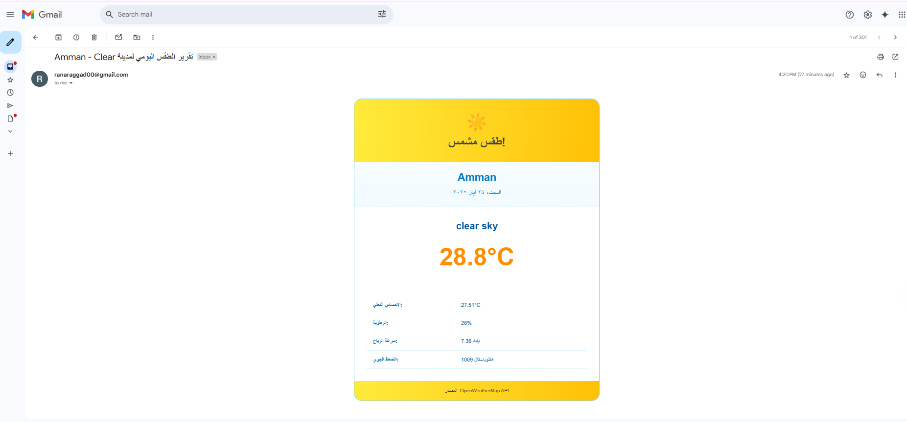

# 🌤️📧 Daily Weather Report Automation with n8n

This project is a fully automated weather report system using [n8n](https://n8n.io), the **OpenWeatherMap API**, and **SMTP**. It sends beautifully styled **Arabic HTML emails** for **Amman, Jordan** twice daily at **9:00 AM and 4:00 PM**.

## ⚙️ Detailed Workflow Breakdown

The n8n workflow is composed of the following nodes:

### 🕘 1. Schedule Trigger
- **Automatically triggers the workflow twice daily** at:
  -  9:00 AM 
  -  4:00 PM
- Node: Schedule (9am & 4pm)

### 🌍 2. Get Weather (OpenWeatherMap)
- Fetches **real-time weather data** for a city (**Amman**).
- Node: Get Weather Amman1

### 🔀 3. Switch Weather Condition
- Identifies the current weather condition using OpenWeatherMap data.
- Decides which email template to use:
  - Clear
  - Clouds
  - Rain / Drizzle / Thunderstorm
  - Snow / Mist / Fog / Dust / Haze

### ✨ 4. Set Email Template
- Depending on the weather, a **custom HTML email template in Arabic** is selected.
- Email styling includes:
  - RTL layout
  - Google Fonts (Tajawal)
  - Icons and colors for each condition
  - Weather details: description, temperature, feels like, humidity, wind speed, pressure

### 📧 5. Send Email
- Sends the styled weather email via **SMTP** to the specified recipients.

## 📥 Email Content

- **Subject:** تقرير الطقس اليومي لمدينة Amman
- **Language:** Arabic
- **Format:** Custom HTML + CSS with RTL layout, shadows, weather icons

## 📸 Real Daily Result for Amman

This is the actual result email automatically sent every day at **9 AM** and **4 PM** for **Amman**:

##  Test Results for Various Weather Conditions

To test each weather scenario, the city name was changed manually to simulate different weather types. Below are screenshots of the email output for each condition:

### 🌫️ Mist / Fog / Haze  
*City used for test: e.g., London*  

### ❄️ Snow  
*City used for test: e.g., Moscow*  

### ☁️ Cloudy  
*City used for test: e.g., Berlin*  

### 🌧️ Rain  
*City used for test: e.g., Kuala Lumpur*  

## 🧩 Technologies Used

- [n8n](https://n8n.io)
- [OpenWeatherMap API](https://openweathermap.org/)
- SMTP (Email integration)
- HTML + CSS (Email templates)
- [Google Fonts - Tajawal](https://fonts.google.com/specimen/Tajawal)

## 📌 Notes

- The real-time emails for Amman are fully **automated**, no manual input is needed.
- Testing screenshots were created to ensure that **all weather branches** in the flow work correctly.

